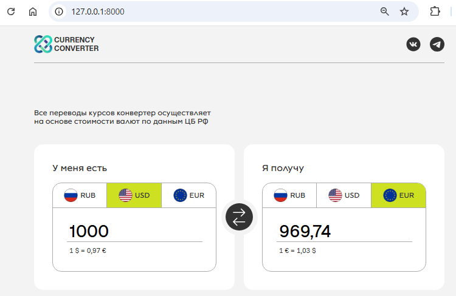
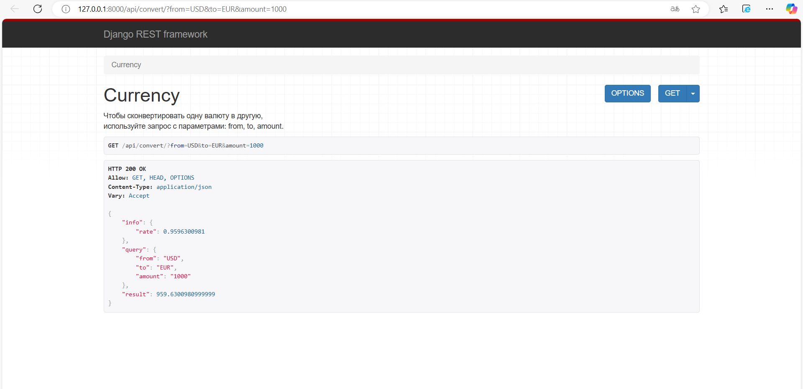
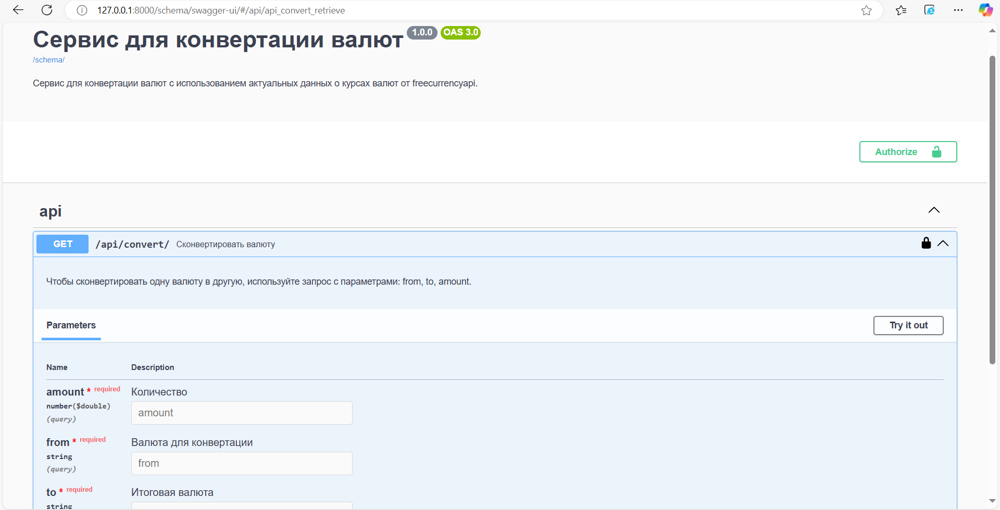
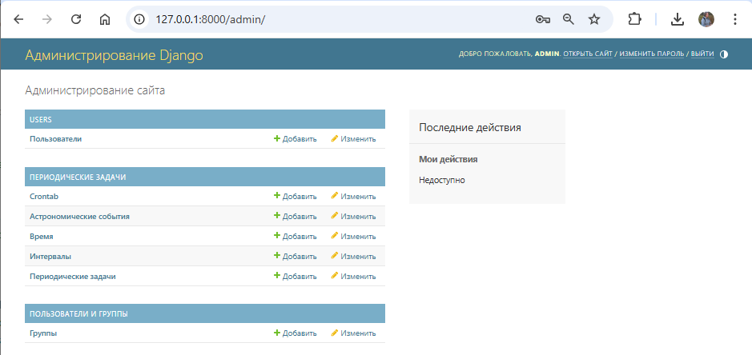

# Сервис для конвертации валют
Проект выполнен в рамках хакатона от Яндекс.Практикума с 3 декабря по 28 декабря 2024 года.  

[Подробная информация о Хакатоне](https://docs.google.com/document/d/1nQz2IvNutPv28m0HGASbrWm13tV1RCPeAaySq19uk1w/edit?tab=t.0)


## Содержание
- [Технологии](#технологии)
- [Задачи](#задачи)
- [Запуск проекта](#запуск-проекта)
- [Структура проекта](#структура-проекта)


## Технологии
### Frontend
HTML5, JavaScript ES6, Sass / SCSS
### Backend
Python, Django REST Framework, drf-spectacular, Redis, Celery, Nginx, Docker, GitHub Actions, Gunicorn, corsheaders


## Выполненные мною задачи 
В команде выступала в роли python-разработчика. В мои задачи входило:
- Анализ сервисов по конвертации валют
- Интеграция со сторонним сервисом по конвертации валют
- Подключение логов
- Создание собственного сервиса для предоставления данных во фронтенд
- Написание тестов (pytest)
- Настройка nginx на прод-сервере для обеспечения cors-политики
- Создание entrypoint.sh для backend/Dockerfile: миграции, сбор и копирование статики, создание админа (создание админа вынесено в management/commands)
- Создание Dockerfile для frontend
- Свод проекта для локального билда, изменение docker-compose.yml   

## Запуск проекта
1. Склонируйте проект:
```bash
git clone https://github.com/belyashnikovatn/currency-converter.git
```
2. Используйте .env.example и создайте свой .env. Примечания:
```
APIKEY                        - токен можно получить здесь - https://freecurrencyapi.com/                
DB_HOST='postgres_db'         - должен совпадать с названием сервиса postgres_db в docker-compose
```

3. В терминал для запуска выполните команду:

```bash
docker compose up --build  -d
```
4. Проект станет доступен [по ссылке](http://127.0.0.1:8000/)
  

5. Интерфейс drf станет доступен [по ссылке](http://127.0.0.1:8000/api/convert/?from=USD&to=EUR&amount=1000)


6. Документация на сервис станет доступна [по ссылке](http://127.0.0.1:8000/schema/swagger-ui/)


7. Админка станет доступна [по ссылке](http://127.0.0.1:8000/admin/)



## Структура проекта

### Приложение api - сервис для конвертации валюты
- Вью для get-запроса и обработки параметров  
- Сериализатор для проверки параметров: наличие, соответствие    

Запрос:  
```
http://127.0.0.1:8000/api/convert?from=USD&to=RUB&amount=125
```
  
Ответ:  
```json
{
  "info": {
    "rate": 100.0191775342
  },
  "query": {
    "amount": "125",
    "from": "USD",
    "to": "RUB"
  },
  "result": 12502.397191775
} 
```
Примеры запросов для тестирования сервиса:  
http://127.0.0.1:8000/api/convert?from=USD&to=EUR&amount=100  
http://127.0.0.1:8000/api/convert?from=rub&to=USD&amount=100  
http://127.0.0.1:8000/api/convert?from=RUB&to=eur&amount=5.5   
http://127.0.0.1:8000/api/convert?from=rub&to=qqq&amount=100   


### Freecurrencyapi - сторонний api-сервис, предоставляющий информацию о стоимости валют
Реализация интеграции с сервисом находится в файле api/external_currency/freecurrencyapi.py  
Чтобы отдельно протестировать работу сервиса:
1. Допишите в конце файла:  
```python
if __name__ == '__main__':
    result = convert('RUB', 'EUR', 10000)
    print(result)
```
2. Запустите файл:
```bash
python api/external_currency/freecurrencyapi.py
```

Документация на сервис - https://freecurrencyapi.com/docs/  
Для подключения к freecurrencyapi нужен apikey, бесплатный тариф имеет ограничения:   
"5k Free Monthly Requests + 32 World Currencies + All exchange rates are updated on a daily basis".  

### Конфиг для логирования
/api/external_currency/config.py

### Связь фронта с бэком:
Для связи фронта с бэкендом на удалённом сервере настроен nginx для обеспечения cors-политики.
Связь фронта с бэком прописасана в файле:
/currency-converter/frontend/src/pages/index.js
строка 23

## Опубликованное приложение

[Ссылка на сайт](https://currency-converter-team2.vercel.app/)

[Фронтенд приложения](https://github.com/hackathon-team-2/currency-converter-frontend)

[Бэкенд приложения](https://github.com/hackathon-team-2/currency-converter-backend)

[Макет в Figma](https://www.figma.com/design/PHxF5BGFK2kv0NvCDQu1xE/%D0%9A%D0%BE%D0%BD%D0%B2%D0%B5%D1%80%D1%82%D0%B5%D1%80?node-id=1-3&t=hhRhzISQrox11Nxz-0)